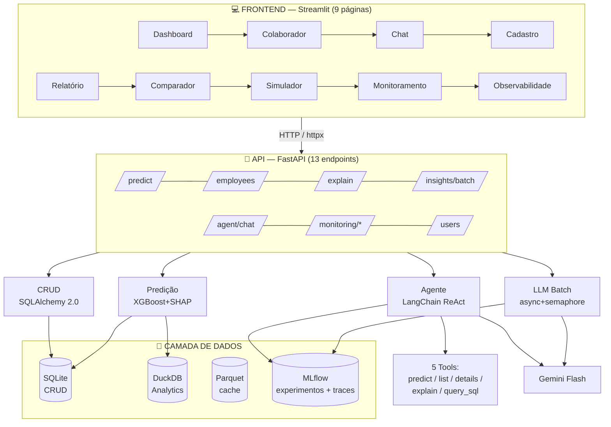

# Arquitetura da Solução

## Visão Geral

A solução é composta por **7 camadas independentes** que se comunicam via API REST. O frontend nunca importa código de ML diretamente — tudo passa pela API para garantir desacoplamento e permitir múltiplos clientes no futuro.

## Camadas

### 1. Camada de Dados

- **SQLite**: banco transacional para CRUD de colaboradores e usuários (via SQLAlchemy 2.0 ORM)
- **DuckDB**: queries analíticas em batch, lê direto do Parquet (100-1000x mais rápido para aggregações)
- **Parquet**: cache de dados processados para performance
- **MLflow**: tracking de experimentos, registry de modelos e traces de GenAI
- **Nota de produção**: em cenário com centenas de milhares de funcionários, migrar para PostgreSQL (concorrência, connection pooling). A camada ORM torna isso uma mudança de connection string.

### 2. Processamento e Preparação

- **ColumnTransformer** (scikit-learn): StandardScaler, OrdinalEncoder, OneHotEncoder
- **Feature Engineering** (`data/feature_engineering.py`): 8 features de domínio — `tenure_ratio`, `satisfaction_index`, `career_stagnation`, `salary_vs_level`, etc.
- Pipeline serializado junto com o modelo (`joblib`) para evitar train/serve skew

### 3. Treinamento do Modelo

- **4 modelos individuais**: LogisticRegression, RandomForest, XGBoost, LightGBM
- **Optuna**: busca bayesiana de hiperparâmetros (50 trials/modelo)
- **MLflow**: tracking de experimentos, métricas, parâmetros e artefatos
- **SMOTE por fold**: evita data leakage no cross-validation (não global)
- **Threshold**: otimizado via Youden's J (equilibra TPR − FPR)
- **Platt Scaling**: calibração via `CalibratedClassifierCV` para probabilidades bem calibradas

### 4. Serviço de Inferência

- **ModelService** (singleton em `inference/predictor.py`): carrega modelo + preprocessor + SHAP explainer uma vez no startup
- **Endpoints**:
  - `POST /predict` — individual com explicabilidade SHAP
  - `POST /predict/batch` — lote com rollback transacional em caso de falha
  - `POST /predict/simulate` — **dry-run** (sem persistir) com overrides arbitrários → usado pelo Simulador "E se?"
- **Níveis de risco**: baixo (<0.2), médio (0.2-0.4), alto (0.4-0.7), crítico (>0.7)
- **Utilitário compartilhado** (`inference/utils.py`): `employee_to_df` usado por rotas, explain e tools (evita duplicação)

### 5. Camada de Agente

- **LangChain** com `create_react_agent` e **Gemini Flash**
- **5 tools** (`agent/tools.py`):
  1. `predict_employee(id)` — risco + probabilidade + fatores SHAP
  2. `list_high_risk_employees(threshold, limit)` — ranking
  3. `get_employee_details(id)` — dados cadastrais
  4. `explain_risk_factors(id)` — explicação interpretável
  5. `query_employees_analytics(sql_query)` — SQL analítica com **hardening** (whitelist de tabelas/CTEs, bloqueia DDL/DML/multi-statement, auto-limit 500)
- **Guardrails 3 camadas** (`agent/guardrails.py`):
  1. **Input**: validação por keywords de domínio + bloqueio de padrões off-topic
  2. **System prompt** restritivo
  3. **Output**: validação de conteúdo antes de retornar
- **Memória de conversação** por `conversation_id`
- **process_message()** refatorado em 4 funções auxiliares (`_extract_response_text`, `_extract_tools_and_tokens`, `_extract_structured_and_chart`, `_rejection_response`) para testabilidade

### 6. Integração com LLM

- **Gemini API** (Google): sync, async e batch
- **Batch processing** : async + semaphore + multi-item prompts → economia expressiva de tokens (um system prompt para N colaboradores)
- **LLMStats**: tracking de tokens, latência e tokens economizados pelo batching
- **Prompts estruturados** (`llm/prompts.py`): output JSON com `risk_level`, `main_factors`, `recommended_actions`, `summary`
- **Retry** com backoff exponencial e tratamento especial de 429 (quota)

### 7. Interface do Usuário (9 páginas)

| # | Página | Função |
|---|--------|--------|
| 1 | **Dashboard** | KPIs, filtros self-service, drivers de risco, ranking paginado, export CSV |
| 2 | **Colaborador** | Perfil completo, gauge, SHAP, análise IA detalhada, export PDF individual, link para Simulador |
| 3 | **Chat** | Agente conversacional com histórico, gráficos automáticos, tradução PT dos valores |
| 4 | **Cadastro** | Criação manual/IA/upload CSV + listagem com filtros + detecção de duplicatas |
| 5 | **Relatório** | PDF consolidado (top-N, manual ou por departamento) com opção de análise IA |
| 6 | **Comparador** | 2-3 colaboradores lado a lado com fatores em linguagem de RH (não técnica) |
| 7 | **Simulador** | "E se?" com 12 atributos ajustáveis — baseline vs cenário via endpoint dry-run |
| 8 | **Monitoramento** | PSI por feature, saúde do modelo, link para MLflow UI |
| 9 | **Observabilidade** | Latência, tokens, custos — separado por tipo (ML local vs LLM) |

- Comunicação exclusiva via API REST
- Gráficos interativos com Plotly
- Tema visual consistente (caixas `#1E2538` externas + `#0F1420` internas)
- Módulo central de tradução (`app/components/translations.py`) — mapa EN→PT aplicado em 100% do front

## Observabilidade e Monitoramento

### PSI (Population Stability Index) — Drift

- Compara distribuição de features treino vs produção
- Semáforo: verde (<0.1), amarelo (0.1-0.2), vermelho (>0.2)
- Recomendação automática de retreino

### Observabilidade Operacional

- Métricas persistidas em SQLite: latência, tokens, custos, inferências
- Tela dedicada com período configurável (1h, 6h, 24h, 48h, 1 semana)
- Separação por tipo: **ML Local** (sem custo por token) vs **LLM (API)** (cobrado por token)

### Tracing de GenAI (MLflow)

- **`mlflow.langchain.autolog()`**: cada `agent.invoke()` gera trace com spans aninhados por tool call
- **`mlflow.gemini.autolog()`**: captura chamadas diretas ao Gemini (client.py, batch.py)
- Experimento dedicado: `hr-genai-traces` (separado do `hr-attrition` do treino)
- Visualização hierárquica na UI com input/output, tokens e latência por span

### Logging Estruturado

- `logging_config.py` com formatter JSON opcional (via env var `LOG_FORMAT=json`)
- Campos fixos: `timestamp`, `level`, `logger`, `message`, `module`, `function`, `line`
- Suporta `extra={}` para enriquecer eventos (ex: `logger.info("ação", extra={"user_id": 42})`)
- Compatível com Splunk, Datadog, CloudWatch, Loki, ELK

### Alertas de Drift

- Módulo `monitoring/alerts.py` com função `send_drift_alert()` compatível com Slack Incoming Webhook, Discord e Teams (via bridge)
- Disparado manualmente ou via cron que chama `/monitoring/drift` periodicamente
- Configurado por env var `DRIFT_WEBHOOK_URL`

## Segurança e Produção

- **CORS** restrito por env var (`CORS_ALLOWED_ORIGINS`), não usa `"*"`
- **SQL injection hardening**: validação regex + whitelist de tabelas + bloqueio multi-statement
- **PUT /employees/{id}**: whitelist explícita de campos atualizáveis (`ALLOWED_UPDATE_FIELDS`)
- **Health check profundo**: testa DB (`SELECT 1`), modelo carregado e existência do `.joblib`
- **Rollback transacional** em `/predict/batch` — consistência atômica

## Reprodutibilidade

- **Pinagem de versões** via `pyproject.toml`
- **Random seed** configurável (`RANDOM_SEED=42`)
- **MLflow registry** com symlink `latest` apontando pro modelo mais recente
- **Docker multi-stage** — build de dependências + runtime
- **Makefile** com alvos padronizados: `seed`, `train`, `serve`, `app`, `test`, `lint`

## Testes

- **93 testes** em `tests/`:
  - `test_api.py` — 21 testes de integração das 13 rotas
  - `test_agent.py` — 18 testes (SQL hardening, tools, orchestrator helpers, process_message mockado)
  - `test_llm.py` — 16 testes (client, batch, stats, retry mockado)
  - `test_ml.py` — 14 testes (trainer, explainer, registry)
  - `test_preprocessing.py`, `test_feature_engineering.py`, `test_drift.py`, `test_guardrails.py` — coberturas unitárias
- Fixtures reutilizáveis em `conftest.py` (DB em memória, ModelService mockado, TestClient FastAPI)
- Meta de cobertura: **≥80%**
